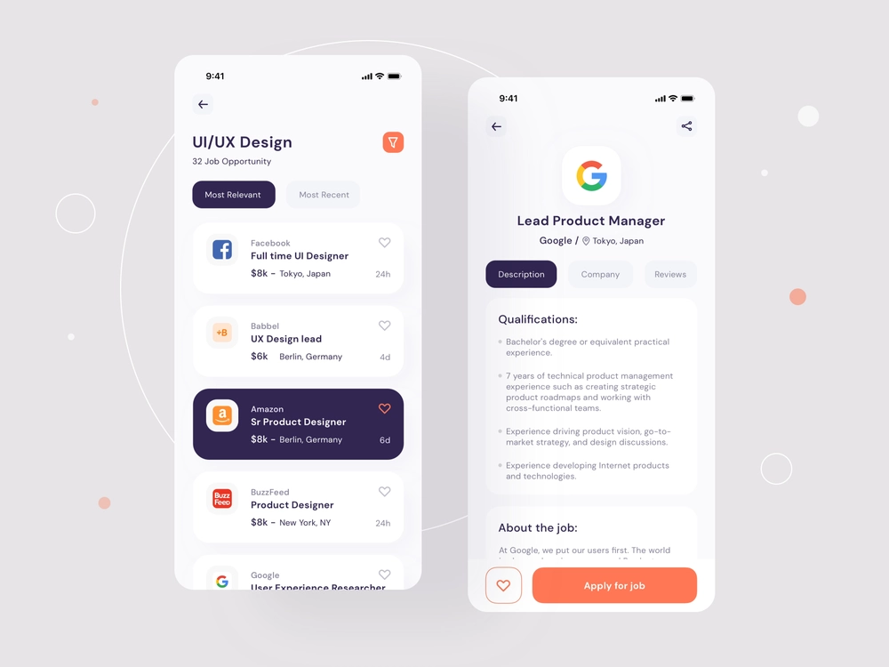
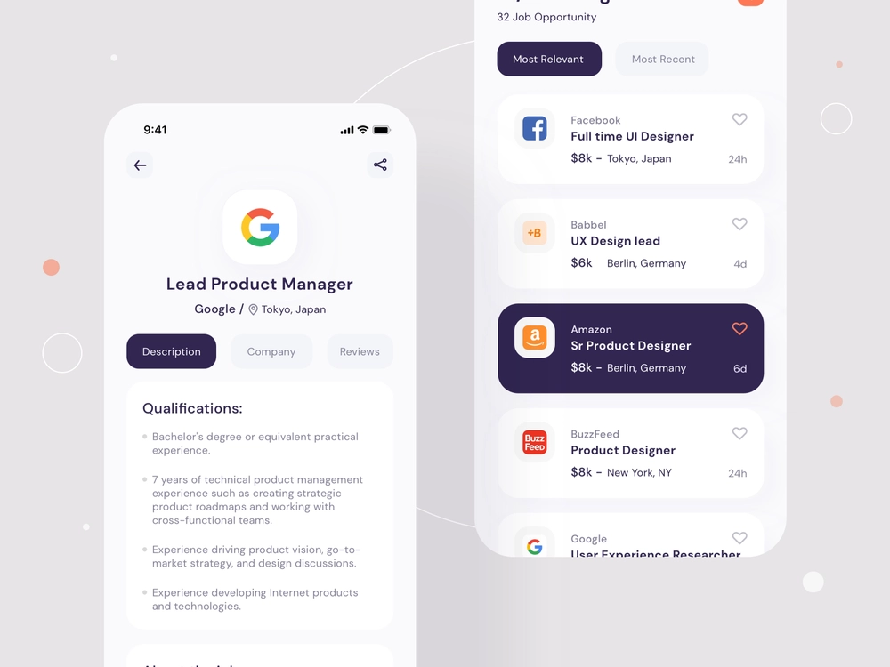

# Project Name :  JOB APPLICATION MOBILE APP

> In this project we are making a Job APplication Mobile App webapp using an external API's

  # Screenshots of design.
  
   

## Live Demo

>(((((Coming Soon)))))

### Prerequisites ♻️

- A personal computer connected to the internet;
- Have a working and updated browser.
- Have a local version control like git installed on your computer
- Have an account on Github, as an online/remote Version Control System
- Code editor (Visual studio code, sublime text, notepad++, ...) installed on your computer;
- At least basic of HTML and CSS.

# Expo Router Example

Use [`expo-router`](https://expo.github.io/router) to build native navigation using files in the `app/` directory.

## 🚀 How to use

```sh
npx create-react-native-app -t with-router
```
### Install

- If you are familiar with git, Run `npm install` to get all dependecies required to run the linters checks, otherwise use the downloaded project on your computer without testing files

## Author

👤 **Gilbert**

- GitHub: [@githubhandle](https://github.com/gilberthappi)
- Twitter: [@twitterhandle](https://twitter.com/dushimimanagil3)
- Gmail: [Gmail](gdushimimana6@gmail.com)


## 🤝 Contributing

Contributions, issues, and feature requests are welcome!

Feel free to check the [issues page](../../issues/).

## Show your support

Give a ⭐️ if you like this project!

## Acknowledgments

- IHUZO Academy
- Hat tip to anyone whose code was used.

## 📝 License

This project is [MIT](./MIT.md) licensed.
